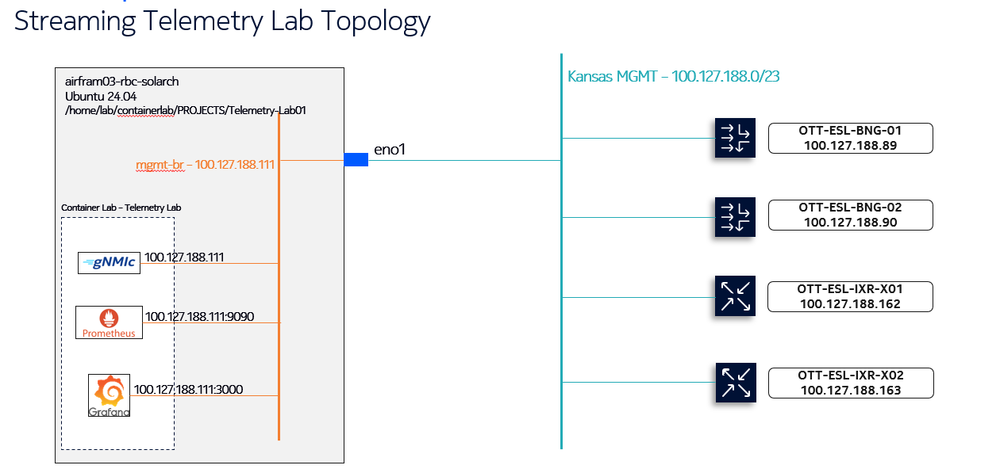

# NOS Streaming Telemetry Lab  (BNG Express Edition)

The **Nokia Streaming Telemetry Lab** showcases real-time monitoring for both  
**Nokia Service Router OS (SR OS)** and **SR Linux** devices.

This lab demonstrates how to

* stream telemetry directly from SR OS / SR Linux routers with **gNMIc**
* ingest the metrics into **Prometheus** and visualise them in **Grafana**
* achieve controller-free, real-time network visibility — a lightweight
  alternative to large NMS / NSP deployments.

Self-contained lab for **Nokia SR OS** streaming telemetry on a single Ubuntu
host (stack: **containerlab → gNMIc → Prometheus → Grafana**).



| Component            | Management IP       | Default Creds        | Notes                              |
|----------------------|---------------------|----------------------|------------------------------------|
| **Telemetry Server** | **100.127.188.111** | `root / Nokia2018!`  | Ubuntu 22/24 LTS – runs containers |
| OTT-ESL-BNG-01       | 100.127.188.89      | `lab / Nokia_ESL!`   | gNMI port 57400                    |
| OTT-ESL-BNG-02       | 100.127.188.90      | `lab / Nokia_ESL!`   | gNMI port 57400                    |
| OTT-ESL-IXR-X01      | 100.127.188.162     | —                    | *(future expansion)*               |
| OTT-ESL-IXR-X02      | 100.127.188.163     | —                    | *(future expansion)*               |

---

## Prerequisites

| Tool              | Install (Ubuntu)                                                                                                   | Purpose            |
|-------------------|--------------------------------------------------------------------------------------------------------------------|--------------------|
| **Git**           | `sudo apt update && sudo apt install -y git`                                                                       | Clone repository   |
| **Docker**        | `sudo apt install -y docker.io`  ➜  `sudo usermod -aG docker $USER && newgrp docker`                               | Container runtime  |
| **containerlab**  | `curl -sL https://get.containerlab.dev \| bash`                                                                    | Deploy topology    |
| **gNMIc CLI** *(optional)* | `bash -c "$(curl -sL https://get-gnmic.openconfig.net)"`                                                   | Ad-hoc gNMI queries|

---

## Quick Start

```bash
git clone https://github.com/shashsha09/NOS-Streaming-telemetry.git
cd NOS-Streaming-telemetry

# deploy the lab
containerlab deploy -t lab/clab.yml


| Service    | URL                                                        | Credentials                                  |
| ---------- | ---------------------------------------------------------- | -------------------------------------------- |
| Prometheus | [http://100.127.188.111:9090](http://100.127.188.111:9090) | —                                            |
| Grafana    | [http://100.127.188.111:3000](http://100.127.188.111:3000) | `admin / Nokia2018!` ← change on first login |

Tear down:

```bash
containerlab destroy -t lab/clab.yml
```

---

## Router-Side gRPC enable (copy & paste)

```text
configure system grpc
    allow-unsecure-connection
    no shutdown
exit

configure system security user "lab"
    password "Nokia_ESL!"
    access console ftp netconf grpc
    console
        no member "default"
        member "administrative"
    exit
exit
```

Apply to each BNG so gNMI telemetry can stream to the server.

---

## Repository Layout

```
NOS-Streaming-telemetry/
├─ lab/
│  ├─ clab.yml                   # containerlab topology
│  └─ configs/
│     ├─ gnmic/                  # gNMIc subscriptions & processors
│     ├─ prometheus/             # prometheus.yml
│     └─ grafana/                # datasource + dashboards
└─ README.md
```

---

## How It Works

* `containerlab` starts **three containers**: **gnmic, prometheus, grafana**.
* gNMIc streams telemetry (CPU, interface, DHCP, BGP …) from the BNGs.
* Prometheus scrapes gNMIc at **[http://localhost:9281/metrics](http://localhost:9281/metrics)** every 5 s.
* Grafana auto-loads dashboards from `lab/configs/grafana/dashboards/`.

---

## Handy gNMIc Commands

```bash
# Capabilities (BNG-01)
gnmic -a 100.127.188.89:57400 -u lab -p Nokia_ESL! --insecure capabilities

# Live CPU usage (BNG-02)
gnmic -a 100.127.188.90:57400 -u lab -p Nokia_ESL! --insecure \
      subscribe --path /state/system/cpu[sample-period=1]/summary/total/time-used
```

---

## Troubleshooting

| Symptom                    | Check / Fix                                                        |
| -------------------------- | ------------------------------------------------------------------ |
| Prometheus target **DOWN** | `docker logs telemetry-gnmic` → exporter running?                  |
| Grafana panel “No data”    | Ensure dashboard variables `$device` / `$iface` have values.       |
| Time-sync warning          | `sudo timedatectl set-ntp true` on the server.                     |
| Need extra metrics         | Edit `lab/configs/gnmic/gnmic-full-config.yml`, add path, redeploy |

---

## License

MIT — see `LICENSE`.

Maintainer  [@shashsha09](https://github.com/shashsha09) • open an Issue for questions or improvements.

````

---

### Commit the update

```bash
git add README.md
git commit -m "README: strip Loki/Promtail, drop secrets export"
git push
````
